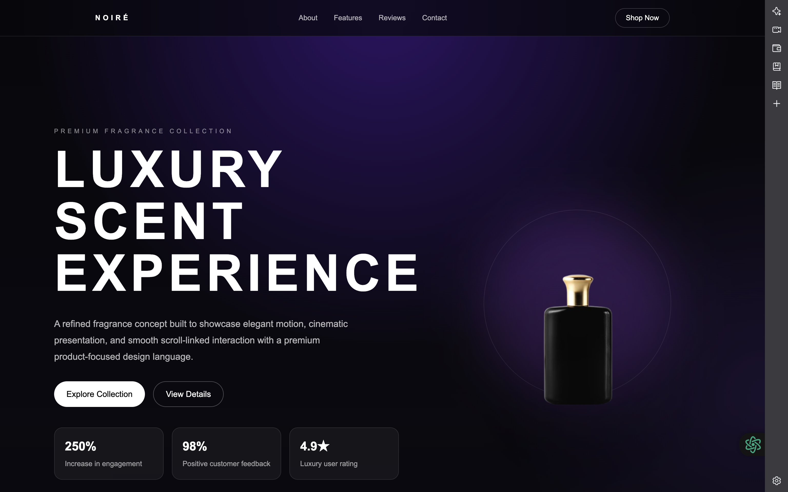
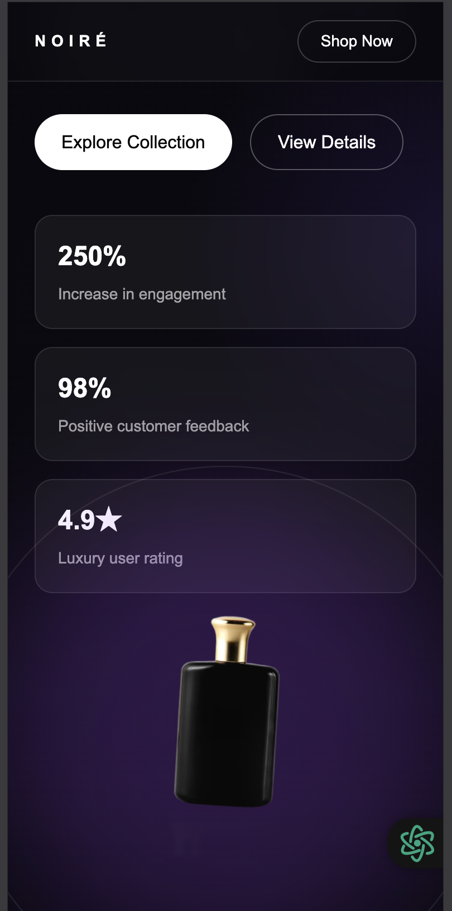
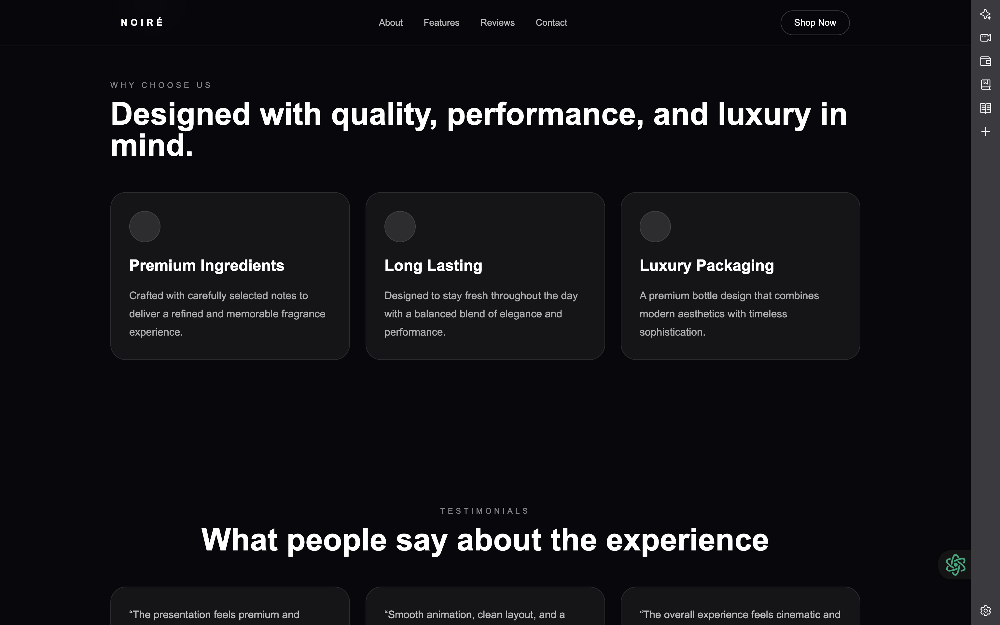

# 🚀 Scroll Hero Animation

A modern and visually engaging web application showcasing smooth scroll-based animations and interactive UI elements. Built with a focus on performance, responsiveness, and clean UI/UX design.

---

## 🌐 Live Demo
👉 https://scroll-hero-animation-two.vercel.app/

---

## 📌 About the Project

This project demonstrates advanced scroll-based animation techniques combined with a clean and minimal interface. The main objective was to create a dynamic user experience where elements respond smoothly to user scrolling behavior.

The application follows a **mobile-first approach**, ensuring seamless performance across different screen sizes and devices.

---

## ✨ Features

- 🎬 Smooth scroll-based animations  
- 📱 Fully responsive (Mobile-first design)  
- ⚡ Fast performance using Vite  
- 🎨 Clean and modern UI/UX  
- 🧩 Component-based architecture (React)  
- 🔄 Interactive and engaging experience  

---

## 🛠️ Tech Stack

- **Frontend:** React.js  
- **Build Tool:** Vite  
- **Styling:** CSS / Styled Components  
- **Deployment:** Vercel  

---

## 📸 Screenshots

### 🖥️ Desktop View
<p align="center">
  
</p>

### 📱 Mobile View
<p align="center">
  
</p>

### ⚙️ Animation / Feature
<p align="center">
  
</p>

### 📜 Full Page View
<p align="center">
  
</p>

---

## 🚀 Getting Started

To run this project locally, follow these steps:

```bash
# Clone the repository
git clone https://github.com/yuns09/scroll-hero-animation.git

# Navigate into the project
cd scroll-hero-animation

# Install dependencies
npm install

# Run the development server
npm run dev
```

---

## 📂 Project Structure

```
scroll-hero-animation/
├── src/
│   ├── components/
│   ├── assets/
│   ├── App.jsx
│   └── main.jsx
├── public/
├── screenshots/
└── package.json
```

---

## 🎯 Key Highlights

- Focused on real-world UI/UX improvements  
- Clean, readable, and maintainable code  
- Responsive design across devices  
- Smooth and optimized animations  

---

## 🔮 Future Improvements

- Add more advanced animations  
- Improve accessibility (ARIA support)  
- Add dark mode  
- Integrate backend for dynamic content  

---

## 👨‍💻 Author

**Mo Yunus** 
🎓 B.Tech (ECE) – 3rd Year  
💻 Full Stack Web Developer  

🔗 GitHub: https://github.com/yuns09  

---

## ⭐ Support

If you like this project, consider giving it a ⭐ on GitHub!

---
